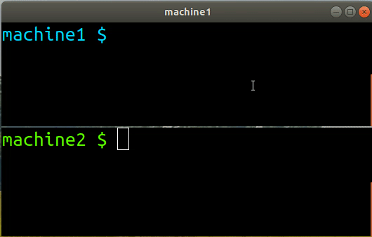
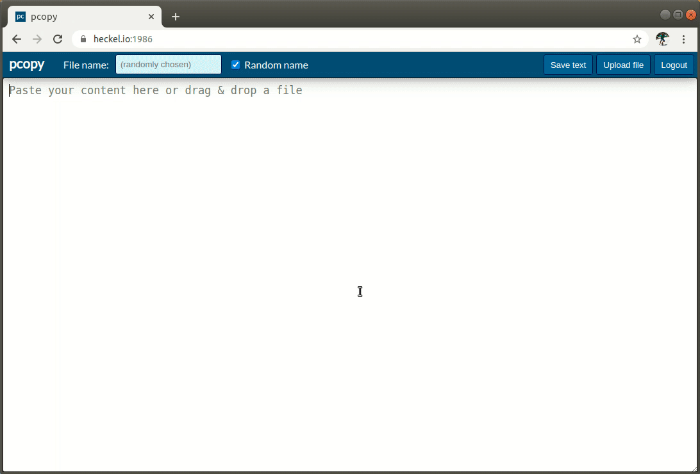
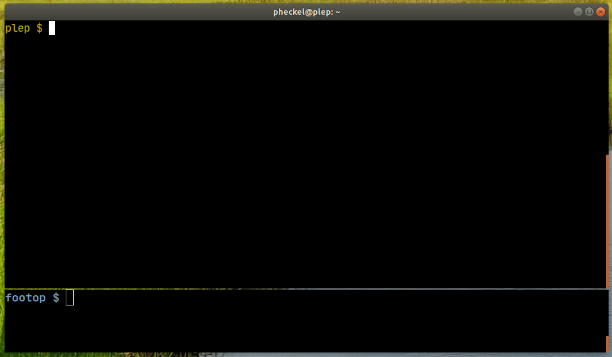
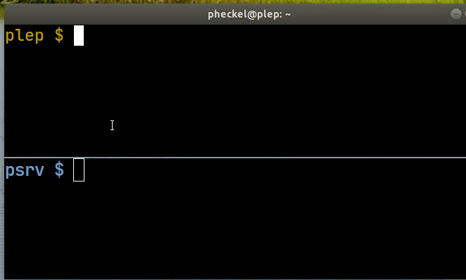
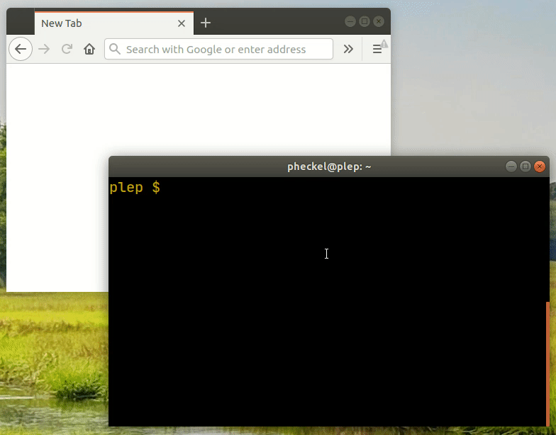
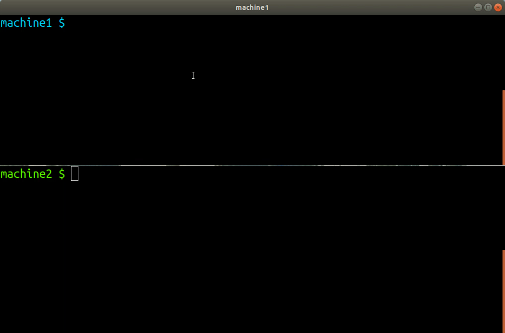

# pcopy
[](https://github.com/binwiederhier/pcopy/releases/latest)
[](https://pkg.go.dev/heckel.io/pcopy)
[](https://github.com/binwiederhier/pcopy/actions)
[](https://goreportcard.com/report/github.com/binwiederhier/pcopy)
[](https://codecov.io/gh/binwiederhier/pcopy)
[](https://gophers.slack.com/archives/C01JMTPGF2Q)

pcopy is a tool to copy/paste across machines. It can be used from the [web UI](#web-ui-for-uploading-text-snippets-or-large-files),
via a CLI or without a client by using curl. It can also be used as a self-hosted NoPaste or as a temporary file hosting service.

After installing the pcopy server, you can use the `pcopy` command line tool to copy from STDIN (`pcp < file.txt`) and 
paste on any connected machine to STDOUT (`ppaste > file.txt`). If you don't have pcopy installed, you can also use its
super simple REST API to copy/paste, e.g. via `curl`.

The web UI allows you to paste text or upload files (even if they are gigabytes in size), and generates 
temporary links you can share with others. 

To see what else pcopy can do, check out the **[live demo](#demo)** (aka [nopaste.net](https://nopaste.net)) or the **[videos](#videos)**.

**Features:**
* 📋 Copy/paste across computers (via STDIN/STDOUT)
* 🔒 HTTPS secure server (via cert-pinning)
* 🔑 Clipboards can be [password-protected](#password-protected-clipboard), or they can be open for everyone
* 📚 Support for [multiple clipboards](#support-for-multiple-clipboards) (e.g. personal, work, ...)
* 🌎 Simple [Web UI](#web-ui-for-uploading-text-snippets-or-large-files) for uploading text snippets or large files
* 🔗 Direct [temporary links](#direct-temporary-links-to-clipboard-content-with-ttlexpiration) to clipboard content (with TTL/expiration) 
* 💻 No-install usage via [curl](#curl-compatible-usage) (`curl nopaste.net`) and [netcat](#nc-compatible-usage) (`echo help | nc -N nopaste.net 9999`)
* 👁️ [Browser-only links](#browser-only-links-that-store-your-data-in-the-url-fragment) that store your data in the URL fragment 



## Installation
Binaries can be found on the [releases page](https://github.com/binwiederhier/pcopy/releases). 

**Debian/Ubuntu** (*from a repository*)**:**   
```bash
curl -sSL https://archive.heckel.io/apt/pubkey.txt | sudo apt-key add -
sudo apt install apt-transport-https
sudo sh -c "echo 'deb [arch=amd64] https://archive.heckel.io/apt debian main' > /etc/apt/sources.list.d/archive.heckel.io.list"  
sudo apt update
sudo apt install pcopy
```

**Debian/Ubuntu** (*manual install*)**:**
```bash
wget https://github.com/binwiederhier/pcopy/releases/download/v0.5.9/pcopy_0.5.9_amd64.deb
dpkg -i pcopy_0.5.9_amd64.deb
```

**Fedora/RHEL/CentOS:**
```bash
rpm -ivh https://github.com/binwiederhier/pcopy/releases/download/v0.5.9/pcopy_0.5.9_amd64.rpm
```

**Docker** (*see [detailed instructions](#docker-usage)*)**:**
```bash
docker run --rm -it binwiederhier/pcopy
```

**Go:**
```bash
# requires Go 1.16
go get -u heckel.io/pcopy
```

**Manual install** (*any x86_64-based Linux*)**:**
```bash
wget https://github.com/binwiederhier/pcopy/releases/download/v0.5.9/pcopy_0.5.9_linux_x86_64.tar.gz
sudo tar -C /usr/bin -zxf pcopy_0.5.9_linux_x86_64.tar.gz pcopy
```

After installation, you may want to check out the [Bash/ZSH autocomplete instructions](#bashzsh-autocompletion).

## Usage

### Set up a pcopy server
To setup a new pcopy server, simply run `sudo pcopy setup` (see [server setup demo](#videos)): 
```bash
sudo pcopy setup
sudo systemctl enable pcopy
sudo systemctl start pcopy
```
This will walk you through an interactive setup wizard and place a config file at `/etc/pcopy/server.conf` (see 
[sample config](configs/pcopy.conf)). The wizard will set up a pcopy user and a systemd service. Once the service 
is started, it listens on port 2586 by default.

If you've enabled the Web UI, you can browse to it an paste text snippets or upload files to it (see [live demo](#demo)).    

### Join an existing clipboard
To join an existing clipboard, you may use `pcopy join`:
```bash
pcopy join private.example.com
pcopy join work.mycorp.com work
pcopy list
```
You can join multiple clipboards and give each of them an optional alias (see `work` clipboard above). Each 
clipboard has its own config file, either in `~/.config/pcopy` or in `/etc/pcopy` (for root). You can list connected
clipboards with `pcopy list`.

### Start copying & pasting
Now you can start copying and pasting by using `pcp` (short for: `pcopy copy`) and `ppaste` (short for: `pcopy paste`). 
Any connected client, regardless of what computer it's on, can copy/paste like this (see [copy/pasting videos](#videos)):

```bash
pcp < foo.txt            # Copies foo.txt to the default clipboard
pcp bar < bar.txt        # Copies bar.txt to the default clipboard as 'bar'
echo hi | pcp work:      # Copies 'hi' to the 'work' clipboard
echo ho | pcp work:bla   # Copies 'ho' to the 'work' clipboard as 'bla'
pcp : img1/ img2/        # Creates ZIP from two folders, copies it to the clipboard

ppaste                   # Reads from the default clipboard and prints its contents
ppaste bar > bar.txt     # Reads 'bar' from the default clipboard to file 'bar.txt'
ppaste work:             # Reads from the 'work' clipboard and prints its contents
ppaste work:ho > ho.txt  # Reads 'ho' from the 'work' clipboard to file 'ho.txt'
ppaste : images/         # Extracts ZIP from default clipboard to folder images/
```

## Advanced features
The server can be configured via the well-documented config file `/etc/pcopy/server.conf` (see [sample config](configs/pcopy.conf)).
Here are a few highlights:

### Password-protected clipboard 
When you set up a new clipboard via `pcopy setup`, you can enter a password. That derives a key, which is stored in the 
config file (see [Key section](https://github.com/binwiederhier/pcopy/blob/4dfeb5b8647c04cc54aa1538b8fb3f5d384c3700/configs/pcopy.conf#L23-L30)).
To add a password after initial setup, use the `pcopy keygen` command.

When joining a clipboard with `pcopy join`, you'll be asked for a password. When using `curl`, you can provide the 
password via `-u :<password>` (see [curl usage](#curl-compatible-usage)). 

### Support for multiple clipboards
You can provide an (optional) alias to a clipboard when you `pcopy join` it (see [join](#join-an-existing-clipboard)).
You may then later reference that alias in `pcp <alias>:..` and `ppaste <alias>:..` (see [copy/paste](#start-copying--pasting)).

To list all your connected clipboards, simple type:
```bash
$ pcopy list
Clipboard Server address   Config file
--------- --------------- ----------------------------
work      10.0.160.67     ~/.config/pcopy/work.conf
default   nopaste.net:443 ~/.config/pcopy/default.conf
```
### Web UI for uploading text snippets or large files
pcopy comes with a Web UI. You can check out the [demo](#demo).   
*(Note: I am not a web guy. I could use some help here!)*



### `curl`-compatible usage 
If you don't want to install `pcopy` on a server, you can use simple HTTP GET/PUT/POSTs, e.g. via `curl`. There's an entire
`curl` [help page](https://nopaste.net/curl) available too if you just type `curl <hostname>`. You may use `-u :<password>` to provide the clipboard
 password (if any). Here's an example for the [demo clipboard](#demo):
```bash
# Show curl help page
curl nopaste.net

# Copy/upload to clipboard (POST/PUT both work)
curl -d Howdy nopaste.net/hi-there
curl -T germany.jpg https://nopaste.net/germany

# Paste/download from clipboard
curl https://nopaste.net/hi-there
```

### `nc`-compatible usage 
Similar to the `curl` API, you can upload files via netcat (`nc`). There's a detailed [help page](https://nopaste.net/nc) available by typing `echo help | nc <hostname> <port>`, e.g. `echo help | nc -N nopaste.net 9999`. Unlike the curl-API, the netcat usage is limited to uploading files only.

```bash
# Show nc help page
echo help | nc -N nopaste.net 9999

# Upload to clipboard
echo check this out | nc -N nopaste.net 9999
cat dog.jpg | nc -N nopaste.net 9999

# Upload with  TTL
(echo "pcopy:?t=30m"; cat dog.jpg) | nc -N nopaste.net 9999
```

### Streaming contents (without storing them on server)
If you have particularly large files to send across, and you know you only want to send them to exactly one server,
you can use ` pcp --stream`. It creates a FIFO device (`mkfifo`) on the server side, and will wait until a reading
client (`ppaste` or `curl ..`) is connected before sending.

```bash
# On machine 1
yes | pcp --stream    # Will block until 'machine 2' is connected

# On machine 2
ppaste | pv > /dev/null
``` 

### Direct temporary links to clipboard content (with TTL/expiration)
You can generate temporary links to clipboard entries with `pcopy link`. You can send this link to someone and they
can download the clipboard content without downloading the client or using any command line tools:

```bash
$ pcopy link hi-there
# Direct link (valid for 2d, expires 2021-01-29 22:35:09 -0500 EST)
https://nopaste.net/hi-there?a=SE1BQyA

# Paste via pcopy (you may need a prefix)
ppaste hi-there 

# Paste via curl
curl -sSL 'https://nopaste.net/hi-there?a=SE1BQyAxNjA'
```

### Limiting clipboard usage
You can limit the clipboard usage in various ways in the config file (see [config file](https://github.com/binwiederhier/pcopy/blob/4dfeb5b8647c04cc54aa1538b8fb3f5d384c3700/configs/pcopy.conf#L66-L101)), 
to avoid abuse:

* `ClipboardSizeLimit`: Limits the total size of the entire clipboard (size of all files)
* `ClipboardCountLimit`: Limits the number of clipboard files
* `FileSizeLimit`: Limits the per-file size
* `FileExpireAfter`: Limits the age of a file (after which they will be deleted)

The [demo clipboard](#demo) uses these settings very restrictively to avoid abuse.

### Browser-only links that store your data in the URL fragment

Inspired by [nopaste.ml](https://nopaste.ml) and [paste](https://github.com/topaz/paste), pcopy also supports links that 
store all data in the URL fragment/anchor (the part in the URL after the `#`) and not on the server. 

When the "Client-side" checkbox is checked in the Web UI, pcopy compresses the text in the editor using LZMA and then 
encodes the result using Base64, e.g. `https://nopaste.net/#XQAAAQAKAA...`. As long as you have this link, this text can
never be deleted and never expires.

Here's an [example](https://nopaste.net/#XQAAAQD/AAAAAAAAAAAkGkAHQ30IXZA3jeQkZZItfPikpd4KaJ5EwL+3jkWf1npuHdpK3Miq3nr2jWTqjzbcQcfEp1beN+JG4OrP2U1B05NIVqx4SK5oEeVjzYaQ7c+ZeI6M28viSMa1/EwPhNjrfvPpa8sNufdVJxUtZX1KphQKpZwAO5ShztZNvnpvpsf2KTtyHw6z4Ybm/nBAKzuJF3fCz1qTnAuGTHA91Kp0s7GbEBP5bGgGNSsqaWesKd9AE59x0Uf27+z+dRdxLev/9U/BQw==). 
When you open the link, pcopy reads, decodes, and decompresses whatever is after the `#`, and displays the result in the editor.
This process is done entirely in your browser, and the web server hosting pcopy never has access to the fragment.

The link is also compatible with the original implementations. Here's the same example for [nopaste.ml](https://nopaste.ml/#XQAAAQD/AAAAAAAAAAAkGkAHQ30IXZA3jeQkZZItfPikpd4KaJ5EwL+3jkWf1npuHdpK3Miq3nr2jWTqjzbcQcfEp1beN+JG4OrP2U1B05NIVqx4SK5oEeVjzYaQ7c+ZeI6M28viSMa1/EwPhNjrfvPpa8sNufdVJxUtZX1KphQKpZwAO5ShztZNvnpvpsf2KTtyHw6z4Ybm/nBAKzuJF3fCz1qTnAuGTHA91Kp0s7GbEBP5bGgGNSsqaWesKd9AE59x0Uf27+z+dRdxLev/9U/BQw==)
and for [topaz's paste](https://topaz.github.io/paste/#XQAAAQD/AAAAAAAAAAAkGkAHQ30IXZA3jeQkZZItfPikpd4KaJ5EwL+3jkWf1npuHdpK3Miq3nr2jWTqjzbcQcfEp1beN+JG4OrP2U1B05NIVqx4SK5oEeVjzYaQ7c+ZeI6M28viSMa1/EwPhNjrfvPpa8sNufdVJxUtZX1KphQKpZwAO5ShztZNvnpvpsf2KTtyHw6z4Ybm/nBAKzuJF3fCz1qTnAuGTHA91Kp0s7GbEBP5bGgGNSsqaWesKd9AE59x0Uf27+z+dRdxLev/9U/BQw==).

You can also generate the links from the command line (thanks to nopaste.ml for this):
```
# Linux
echo -n 'Hello World' | lzma | base64 -w0 | xargs -0 printf "https://nopaste.net/#%s\n"

# Mac
echo -n 'Hello World' | lzma | base64 | xargs -0 printf "https://nopaste.net/#%s\n"

# Windows / WSL / Linux
echo -n 'Hello World' | xz --format=lzma | base64 -w0 | printf "https://nopaste.net/#%s\n" "$(cat -)"
```

### Docker usage
To use the [pcopy image](https://hub.docker.com/r/binwiederhier/pcopy), simply pull it and set up a few 
shell aliases to simplify local usage: 

```bash
docker pull binwiederhier/pcopy
alias pcopy="docker run --rm -v ~/.cache/pcopy:/var/cache/pcopy -v ~/.config/pcopy:/etc/pcopy -p 2586:2586/tcp -it binwiederhier/pcopy"
alias pcp="pcopy copy"
alias ppaste="pcopy paste"
```

This maps the following folders and ports (you may choose different host folders):
* Config folder: `/etc/pcopy` (image) to `~/.config/pcopy` (host)
* Clipboard folder (only for server usage): `/var/cache/pcopy` (image) to `~/.cache/pcopy` (host)
* Service port (only for server usage): 2586 (both image and host) 

You can then use pcopy just like it was installed on your host system. To use it as a client, run 
`pcopy join` (see [join instructions](#join-an-existing-clipboard)). To set up a server, run

```bash
pcopy setup
pcopy serve
```

### Bash/ZSH autocompletion
Tab completion is available for Bash and ZSH. For Bash, when installed via rpm/deb, autocomplete is immediately
available. ZSH autocomplete installation is manual.

**Bash** (*only if not installed via rpm/deb*):
```
sudo wget -O /etc/bash_completion.d/pcopy https://raw.githubusercontent.com/binwiederhier/pcopy/master/scripts/autocomplete_bash
sudo ln -s /etc/bash_completion.d/pcopy /etc/bash_completion.d/pcp
sudo ln -s /etc/bash_completion.d/pcopy /etc/bash_completion.d/ppaste
```

**ZSH**:
```
mkdir -p ~/.config/pcopy
wget -O ~/.config/pcopy/autocomplete_zsh https://raw.githubusercontent.com/binwiederhier/pcopy/master/scripts/autocomplete_zsh
for p in pcopy pcp ppaste; do echo "PROG=$p source ~/.config/pcopy/autocomplete_zsh" >> ~/.zshrc; done
```

## Demo
I run a small nopaste service on **[nopaste.net](https://nopaste.net)** that you can play with. It has quite a few 
limits in place, but you'll be able to get a feel for it:

- To join via the command line: `pcopy join nopaste.net:443` (see [join instructions](#join-an-existing-clipboard))
- Or use the [web UI](https://nopaste.net) (this is *work in progress*, I'm not a web designer, please help!)
- Or simply type `curl nopaste.net` (see [curl usage](#curl-compatible-usage)) 

**Limits:**   
Since [nopaste.net](https://nopaste.net) is publicly available, I put quite strict limits in place. It is limited to 
2 GB total, 500 KB per file, 10,000 files. Files expire after 2 days. Also, overwriting files is disabled (which, if
you use it as a personal clipboard, is quite nonesensical, but it makes sense for a nopaste).

I also made a couple [more videos](#videos) to show what else pcopy can do.

## Videos

<table>
  <tr>
    <td></td>
    <td></td>
    <td></td>
  </tr>
  <tr>
    <td>Simple copy & paste</td>
    <td>Setting up a new server</td>
    <td>Copying entire folders</td>
  </tr>
  <tr>
    <td></td>    
    <td></td>
    <td></td>
    <td></td>
  </tr>
  <tr>
    <td>Creating a link to a password-protected clipboard</td>        
    <td>Copying/uploading through the Web UI</td>
    <td>Copy/pasting with `curl`</td>
    <td></td>
  </tr>
</table>

## Command-line help
Each command has a detailed help page. Simply type `pcopy -help`, `pcp -help`, etc. Here's the main help page:
```bash 
$ pcopy --help
NAME:
   pcopy - copy/paste across machines

USAGE:
   pcopy COMMAND [OPTION..] [ARG..]

COMMANDS:
   Client-side commands:
     copy, c    Read from STDIN/file(s) and copy to remote clipboard
     paste, p   Write remote clipboard contents to STDOUT/file(s)
     join, add  Join a remote clipboard
     leave, rm  Leave a remote clipboard
     list, l    Lists all of the clipboards that have been joined
     link, n    Generate direct download link to clipboard content
   Server-side commands:
     serve   Start pcopy server
     setup   Initial setup wizard for a new pcopy server
     keygen  Generate key for the server config

Try 'pcopy COMMAND --help' for more information.
``` 

## Building
Building pcopy is dead simple, however it does need Go >=1.16, because it uses [embed](https://tip.golang.org/pkg/embed/). 
Here's how you build it:

```
make build-simple
# Builds to dist/pcopy_linux_amd64/pcopy
``` 

To build releases, I use [GoReleaser](https://goreleaser.com/). If you have that installed, you can run `make build` or 
`make build-snapshot`.

## Contributing
I welcome any and all contributions. Just create a PR or an issue, or talk to me [on Slack](https://gophers.slack.com/archives/C01JMTPGF2Q).

## Inspired by
Thanks [nakabonne](https://github.com/nakabonne) for making [pbgopy](https://github.com/nakabonne/pbgopy), and for 
[posting it on Reddit](https://www.reddit.com/r/golang/comments/k2nzyn/pbgopy_copy_and_paste_between_devices/gdwpy8u/?context=3). 
It inspired me to make pcopy. 

The Web UI as well as the client-side mode are inspired by [nopaste.ml](https://nopaste.ml/).

As many may instantly notice, pcopy is similar to [pbcopy/pbpaste](https://osxdaily.com/2007/03/05/manipulating-the-clipboard-from-the-command-line/). 
However, pcopy can copy/paste across the network. You can copy on your laptop and paste on your servers.

pcopy may also replace [scp](https://linux.die.net/man/1/scp) or [rsync](https://linux.die.net/man/1/rsync) in simple cases,
when you just want to copy a file or folder across to another computer. 

## License
Made with ❤️ by [Philipp C. Heckel](https://heckel.io), distributed under the [Apache License 2.0](LICENSE).

Third party libraries:
* [github.com/urfave/cli/v2](https://github.com/urfave/cli/v2) (MIT) is used to drive the CLI
* [CryptoJS](https://github.com/brix/crypto-js) (MIT) is used for key derivation and such in the Web UI
* [LZMA-JS](https://github.com/LZMA-JS/LZMA-JS) (MIT) is used for client-side mode to compress text
* [Lato Font](https://www.latofonts.com/) (OFL) is used as a font in the Web UI
* [GoReleaser](https://goreleaser.com/) (MIT) is used to create releases 

Code and posts that helped:
* [Drag & Drop](https://stackoverflow.com/a/33917000/1440785) (CC BY-SA 3.0)
* [Progress indicator](https://github.com/machinebox/progress) (Apache 2.0)
* [Rate limiting](https://www.alexedwards.net/blog/how-to-rate-limit-http-requests) (MIT)
* [Find common directory](https://rosettacode.org/wiki/Find_common_directory_path#Go) (GFDLv1.2)
* [Full page centering](https://medium.com/creative-technology-concepts-code/full-page-site-with-vertical-centering-using-css-only-7858ed6764c4)
* [Human readable file sizes](https://yourbasic.org/golang/formatting-byte-size-to-human-readable-format/)
* [Unzipping files](https://golangcode.com/unzip-files-in-go/)
* [HTTP server routing](https://benhoyt.com/writings/go-routing/#regex-table)
* [HTTP server error handling](https://thingsthatkeepmeupatnight.dev/posts/golang-http-handler-errors/)
* [Google Webfonts Helper](https://google-webfonts-helper.herokuapp.com/)
